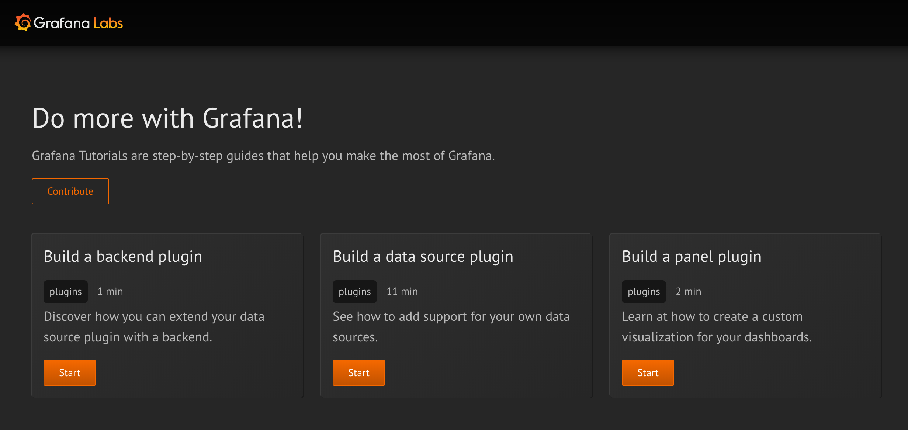

# Grafana Tutorials

[](LICENSE)

[Grafana Tutorials](https://storage.googleapis.com/grafana-tutorials/index.html) are step-by-step guides that help you make the most of Grafana.



**Important:** This project is in early development, and is not fit for production use. The tutorials are based on experimental APIs, which are subject to change.

## Requirements

Tutorials are built using [claat](https://github.com/googlecodelabs/tools/tree/master/claat):

**Important:** This repository currently needs a [fork](https://github.com/marcusolsson/tools/tree/markdown-import), that support fragment imports for Markdown. For more information, refer to the [pull request](https://github.com/googlecodelabs/tools/pull/375).

## Usage

To build the static site, run the build script:

```
./build.sh
```

## Development

To run a web server inside the `public` directory:

```
cd public
claat serve
```

## Resources

- [Google Codelabs Tools](https://github.com/googlecodelabs/tools)
- [Google Developer Codelabs](https://codelabs.developers.google.com/)
- [Ubuntu Tutorials](https://tutorials.ubuntu.com/)
